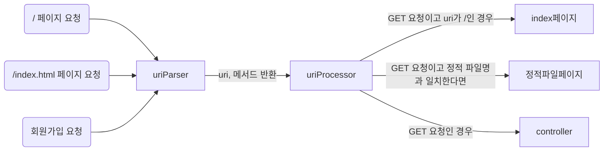

```mermaid
graph LR
  requestHome(/ 페이지 요청) --> uriParser -- uri, 메서드 반환 --> uriProcessor -- GET 요청이고 uri가 /인 경우 --> index페이지
  uriProcessor -- GET 요청이고 정적 파일명과 일치한다면 --> 정적파일페이지
  requestIndex(/index.html 페이지 요청) --> uriParser
  requestSignup(회원가입 요청) --> uriParser
  uriProcessor -- GET 요청인 경우 --> controller
```
